# 教師履歷管理系統

109703039 金娜伶、111354007 韓昕頻、111354014 劉貞莉、112354030 陳宏丞、112354001 林兆鵬、112753125 楊佳勳

## 為何需要教師履歷管理系統？

教師履歷為學校教師各樣論著、研究、獎項等事蹟紀錄，是衡量教師們於研究和教學貢獻的指標之一，更是AACSB與EQUIS等國際認證審查的內容。為了更有效率地搜集教師履歷資料，此系統旨在簡化資料彙整流程，並自動化產生國際認證所需的報表，提供學院參考。

## 資料蒐集對象

2019年至2024年內，下述定義的老師皆須填入：

1. 單位內專任老師
2. 單位內兼任老師
3. 外院專兼任老師支援開課請填入，視為兼任老師
4. 院內合聘老師由主系所填寫，視為專任
5. 跨院合聘需填入，視為專任老師
6. MBA、IMBA、EMBA的院內外系支援專任老師需要填入，視為專任
7. 跨校合聘(非主聘)視為兼任，跨校合聘(主聘)視為專任

# 過往的教師履歷彙整流程

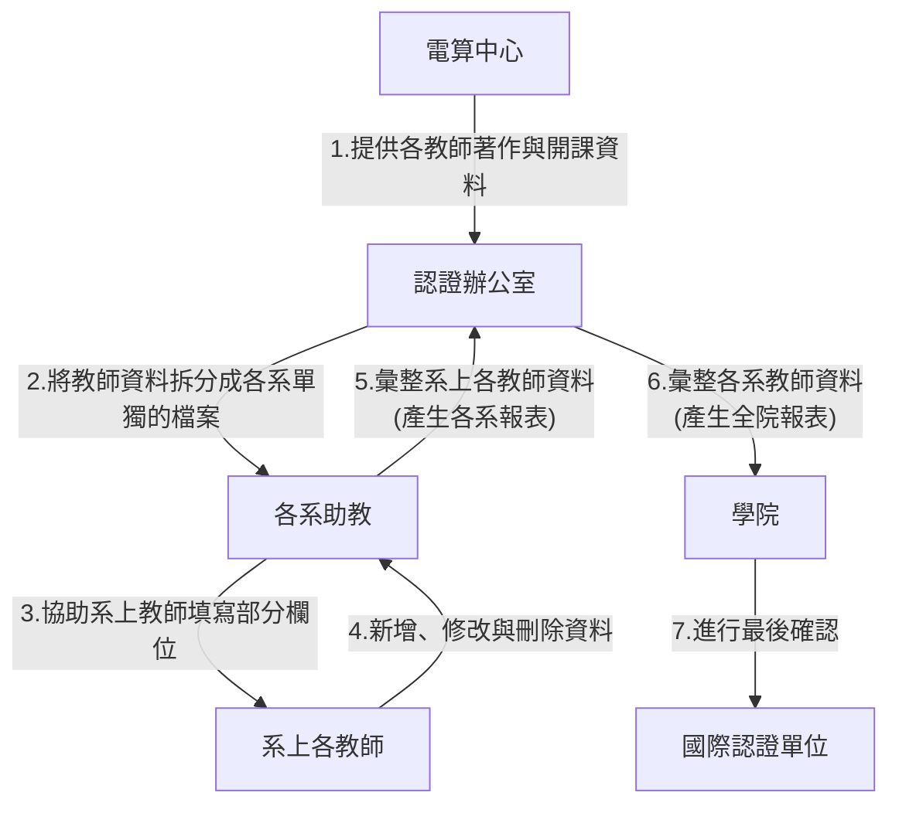

## 1.電算中心提供各教師著作與開課資料

| 資料表名稱 | 欄位                                                                     |
|----------|------------------------------------------------------------------------|
| 教師清單   | 教師編號, 姓名, 系所代碼, 系所名稱, 職稱, 專兼別                         |
| 獎項       | 單位代碼, 單位名稱, 序號, 教師代號, 教師姓名, 年度, 頒獎單位, 獎項, 備註 |
| 研究計畫 | 系所代碼, 系所名稱, 教師代號, 教師姓名, 計畫職稱, 核定年度, 起始年度, 主持人代碼, 主持人, 校內編號, 計畫名稱, 委託單位, 計畫類別	, 起迄日期
| 論著資料 | 系所代碼, 系所名稱, 教師編號, 教師姓名, 論著編號, 論著名稱, 論著名稱二, 論著日期, 論著類別, 期刊名, 期刊資料庫所屬, 審查制度, 專書性質, 著作人數, 合著者1, 合著者2, 合著者3, 合著者4, 合著者5, 合著者6, 合著者7, 合著者8, 合著者9, 合著者10, 合著者11	, 合著者12 |

注意：同一位教師有可能因專兼別不同而有兩個教師編號，有此情況大多是專任教師退休後轉兼任，只有少數情況為博士後研究員從兼任轉為專任。

## 2.認證辦公室將教師資料拆分成各系單獨的檔案

認證辦公室依據電算中心資料拆分成各系單獨的檔案，同時製作每位教師空白的A1-A3清單檔，使各系助教收到一份「全系教師的電算中心資料」，以及全系教師每人一份的「A1-A3清單檔」，並將上述所有資料寄給相對應系所的系助教。

例如：全院共有五個系所，每個系都有十位教師，則認證辦公室要將電算中心資料拆分成各系所一份的「全系教師的電算中心資料」，共五個檔案；接著再以個別教師為單位，每個系所各有十位教師的「A1-A3清單檔」，共五十個檔案。由此可知，每位系助教會收到屬於自己系的十一份檔案。

### ➤此階段資料處理需求：

1. 篩選與貼上的步驟十分繁瑣且一致，是否能直接透過指令一次性輸出所有檔案？
2. 抑或是不輸出檔案，改成讓各系助教與教師能自行登入網站進行填寫與確認的動作，唯各系助教的修改權限為系上教師，個別教師只能編輯個人。

## 3.各系助教協助系上教師填寫部分欄位

各系助教需要先協助系上教師填寫「A1-A3清單」，需參考「全系教師的電算中心資料」後填入以下內容：

* 論著目錄清單：期刊、會議論文、專書、個案、教學教材
* 重要研究獎項(E15=A4)
* 參與專業/公共政策制訂法案名稱(E3=A8)
* 指導畢業的博士論文(E14=A9)
* 政府或產業計畫、國科會計畫(E15=A9)

| 欄位名稱                          | 欄位選項                                                                                                              | 欄位說明                                                |
|-------------------------------|-------------------------------------------------------------------------------------------------------------------|-----------------------------------------------------|
| 系所                            | Accounting, BA, DBA, EMBA, Finance, Intl Buss, IMBA, MBA, MIS, M & B, RMI, Statistics, TIM & IIP                  |                                                     |
| 姓名(中文)                        |                                                                                                                   |名字中間請勿空格                                     |
| 姓名(英文)                        |                                                                                                                   |                                                     |
| 年度(西元)                        | 2019-2023                                                                                                         | 以起始年度為準                                             |
| SSCI/SCI/TSSCI or equivalent | O,X                                                                                                               | 是期刊論文資料才需要判別此欄，其他資料皆為X                              |
| 與本院教授共同創作                     |                                                                                                                   | 註明合著作者姓名                                          |
| 與本院學生或本校外院師生或校外人士共同創作     |                                                                                                                   | 註明合著作者姓名                                          |
| 篇名                            |                                                                                                                   | 若為期刊、會議論文、專書、個案、教學教材，請 key 篇名；若為重要研究獎項，請 key 獎項名稱；若為參與專業/公共政策制訂法案名稱，請 key 政策法案名稱；若為指導畢業的博士論文，請 key 論文題目；若為政府或產業計畫、國科會計畫，請 key 計畫名稱。|
| Journal名稱                     |                                                                                                                   | 是期刊論文資料才需要填寫此欄，其他資料勿貼，如：研討會論文、專書、篇章、個案、研究獎項等，不用填寫此欄 |
| 屬性                            | Basic_or_Discovery_Scholarship, Applied_or_Integration_Application_Scholarship, Teaching_and_Learning_Scholarship | 依序為學術、實務、教學三種                                       |
| EQUIS的分類                      | E1-E15                                                                                                            | 見「屬性與EQUIS分類」表格，不同屬性會有不同的EQUIS分類可選擇                 |
| AACSB的分類                      | A1-A3                                                                                                            | 見「EQUIS與AACSB分類對照」表格，可用公式對照自動產生                     |

#### 屬性與EQUIS分類：

| Basic_or_Discovery_Scholarship                                         | Applied_or_Integration_Application_Scholarship                                                    | Teaching_and_Learning_Scholarship                    |
|------------------------------------------------------------------------|---------------------------------------------------------------------------------------------------|------------------------------------------------------|
| E1:Academic Research Articles                                          | E2:Practices-oriented Articles                                                                    | E1:Academic Research Articles                        |
| E4:Papers in Academic conferences                                      | E3:Studies and Reports commissioned by companies and gov't agencies(企業、政府、科技部產學合作計畫) | E4:Papers in Academic conferences                    |
| E7:Books (e.g. research monographs)                                    | E5:Papers in Professional conferences                                                             | E5:Papers in Professional conferences                |
| E8:Chapters in books                                                   | E6:Published Case Studies                                                                         | E6:Published Case Studies                            |
| E12:Studies and Reports produced as part of an int'l network           | E7:Books (e.g. research monographs)                                                               | E7:Books (e.g. research monographs)                  |
| E14:Doctoral theses completed-supervised by core faculty               | E8:Chapters in books                                                                              | E8:Chapters in books                                 |
| E15:Other(Competitive Research Awards Received)獲重要研究獎項次數      | E9:Textbooks                                                                                      | E9:Textbooks                                         |
| E15:Other(Please describe)其他(科技部學術型計畫 MOST Research Project) | E10:Chapters in textbooks                                                                         | E10:Chapters in textbooks                            |
|                                                                        | E12:Studies and Reports produced as part of an int'l network                                      | E11:Articles on Pedagogic Development and Innovation |
|                                                                        | E15:Other(Competitive Research Awards Received)獲重要研究獎項次數                                 | E13:Published Teaching Materials                     |

#### EQUIS的分類定義說明:

* E1: 期刊論文
* E3: Studies and Reports commissioned by companies and gov't agencies(企業、政府、科技部產學合作計畫)，務必完整填寫有報告產出的案件 / 非科技部研究計劃
* E4: 會議論文
* E7: 專書
* E8: 專書篇章
* E12: 研究報告
* E15: Other(Competitive Research Awards Received)獲重要研究獎項次數
* E15: Other(Please describe)其他(科技部學術型計畫 MOST Research Project)

#### EQUIS與AACSB分類對照：

| EQUIS分類                                                                              | AACSB分類                                                              |
|--------------------------------------------------------------------------------------|----------------------------------------------------------------------|
| E1:Academic Research Articles                                                        | A1:Peer-Reviewed Journals Articles                                   |
| E2:Practices-oriented Articles                                                       | A1:Peer-Reviewed Journals Articles                                   |
| E3:Studies and Reports commissioned by companies and gov't agencies(企業、政府、科技部產學合作計畫) | A2:Additional peer- or editorial-reviewed intellectual contributions |
| E4:Papers in Academic conferences                                                    | A1:Peer-Reviewed Journals Articles                                   |
| E5:Papers in Professional conferences                                                | A2:Additional peer- or editorial-reviewed intellectual contributions |
| E6:Published Case Studies                                                            | A2:Additional peer- or editorial-reviewed intellectual contributions |
| E7:Books (e.g. research monographs)                                                  | A2:Additional peer- or editorial-reviewed intellectual contributions |
| E8:Chapters in books                                                                 | A2:Additional peer- or editorial-reviewed intellectual contributions |
| E9:Textbooks                                                                         | A2:Additional peer- or editorial-reviewed intellectual contributions |
| E10:Chapters in textbooks                                                            | A2:Additional peer- or editorial-reviewed intellectual contributions |
| E11:Articles on Pedagogic Development and Innovation                                 | A3:All other intellectual contributions                              |
| E12:Studies and Reports produced as part of an int'l network                         | A3:All other intellectual contributions                              |
| E13:Published Teaching Materials                                                     | A3:All other intellectual contributions                              |
| E14:Doctoral theses completed-supervised by core faculty                             | A3:All other intellectual contributions                              |
| E15:Other(Competitive Research Awards Received)獲重要研究獎項次數                             | A2:Additional peer- or editorial-reviewed intellectual contributions |
| E15:Other(Please describe)其他(科技部學術型計畫 MOST Research Project)                         | A3:All other intellectual contributions                              |

### ➤此階段資料處理需求：

1. 「與本院教授共同創作」與「與本院學生、本校外院師生、校外人士共同創作」在原始資料中無細分，還有寫法或中英文不一致而難以查找的問題，需要另外判斷或是新增填寫欄位讓老師填寫
2. 可否在教師填寫時，初步判別EQUIS的分類？選項跳出後再由教師進一步確認

## 4.各教師新增、修改與刪除資料

當系所助教完成「A1-A3清單」填寫後，會寄給系上各教師確認內容是否需要修改，同時附上以下「教師履歷表單」請每位教師填寫：

| 欄位名稱                                    | 欄位說明                          |
|-----------------------------------------|-------------------------------|
| 姓名(中文)                                  |                               |
| 姓名(英文)                                  |                               |
| 教育背景 Education                          | 請填英文，包含修業起訖年月、學校與科系|
| 經歷 Teaching and Prefessional Experience | 請填英文                          |
| 教學興趣 Teaching Interests                 | 請填英文                          |
| 研究興趣 Research Interests                 | 請填英文                          |
| 學群       | 每位教師自行選擇自身專業所屬學群：Accounting, Actuarial Science, Behavioral Science / Organizational Behavior, Business Communication, Business Education, Business Ethics - incl Corporate Social Responsibility, Business Law / Legal Enviroment, Computer or, Management Information Systems, Consulting, Data Analytics, E-Business - inxl Economics, Economics / Mnagerial Economics, Entrepreneurship / Small Business Admin, Finance - incl Banking, General Business, HR Mgt - incl, Personnel & Ind / Labor Relations, Insurance, Intellectual Property, International Business, Management, Manufacturing and Technology Management, Marketing, Operations Research, Production / Operations Management, Public Administration, Quantitative Methods, Real Estate, Statistics, Strategic Management, Supply Chian / Transport / Logistics, Taxation |
| 近一年教授高管班(指無學位的課程)，如：企家班。         | 有請填1，無請填0                     |
| 近一年教學責任-其他服務，如：借調、期刊編輯、主編、審稿     | 有請填1，無請填0                     |
| 近一年借調至產學界或政府機關                   | 有請填1，無請填0                     |
| 近一年參與產業界的活動或與產業界主管有聯繫互動          | 有請填1，無請填0                     |
| 近一年參與產業經營或擔任專業職務                 | 有請填1，無請填0                     |
| 近一年於學會/協會組織擔任高階職務                | 有請填1，無請填0                     |
| 近一年參與學會/協會團體組織之活動                | 有請填1，無請填0                     |
| 近一年長期提供企業諮詢（一年以上）                | 有請填1，無請填0                     |
| 近一年擔任董事會（理事會）/監察人（監事）相關職務        | 有請填1，無請填0                     |
| 近一年具商管教育經歷並持續累積中                 | 有請填1，無請填0                     |
| 近一年參與學術/業界相關之活動/社群/學會/協會         | 有請填1，無請填0                     |
| 近一年於業界擔任重要職務                     | 有請填1，無請填0                     |
| 近一年具有產業界全職或兼職之工作                 | 有請填1，無請填0                     |
| 近一年企業主、合夥人、或專業經理人                | 有請填1，無請填0                     |
| 近一年業界活躍人士                        | 有請填1，無請填0                     |
| 近一年會計師、律師或擁有其他專業證照                  | 有請填1，無請填0                     |
| 近一年行政職務1                                   | 填寫職務名稱(中文)、職務名稱(英文)、擔任起訖時間 |
| 近一年行政職務2                                   | 填寫職務名稱(中文)、職務名稱(英文)、擔任起訖時間 |
| 近一年行政職務3                                   | 填寫職務名稱(中文)、職務名稱(英文)、擔任起訖時間 |

注意：資料欄位中「近一年」指調查時間的最後一年之所屬學年度，如2019-2024年的報告，是要調查112學年度，亦即2023.08.01-2024.07.31為近一年。

### ➤此階段資料處理需求：

1. 與前面的情況類似，每位教師各填一份檔案，就需要有助教另外彙整，是否能建構系統讓教師登入填寫，資料庫便能及時取得相對應的資料，不用人力一一複製貼上。
2. 電算中心檔案「科目與教職員資料」有教師校外兼職名冊，是否使用？

## 5.各系助教彙整系上各教師資料 (產生各系報表)

教師們完成「A1-A3清單」確認與「教師履歷表單」填寫後，由系所助教回收所有教師的個別檔案，並確認資料皆已填上且無誤，即可將每位教師的個別資料匯入系所總表「統整表格」，包括以下三個部分：

### (1) A1-A3清單總表

注意：調查期間才聘入的老師不需填寫，下年度再填即可

直接將每位教師的「A1-A3清單」貼入總表，讓Excel公式自動計算後續內容。

### (2) 教師履歷總表

注意：調查期間才聘入的老師不需填寫，下年度再填即可

#### a. 第一部分資料：

| 輸入方式 | 欄位名稱      | 欄位說明                                                                                                                                                                                                                                                                                                                                                                                                                                                                                                                                                                                                                                                                                                                                                                                                                        |
|------|-----------|-----------------------------------------------------------------------------------------------------------------------------------------------------------------------------------------------------------------------------------------------------------------------------------------------------------------------------------------------------------------------------------------------------------------------------------------------------------------------------------------------------------------------------------------------------------------------------------------------------------------------------------------------------------------------------------------------------------------------------------------------------------------------------------------------------------------------------|
| 手動   | 員工編號      | 上學期專任，下學期兼任，請一格內填入2個員工編號                                                                                                                                                                                                                                                                                                                                                                                                                                                                                                                                                                                                                                                                                                                                                                                                    |
| 連結   | 姓名(中文)    | 符合「蒐集對象」的教師皆需填入（無空格），可參照教師履歷                                                                                                                                                                                                                                                                                                                                                                                                                                                                                                                                                                                                                                                                                                                                                                                    |
| 連結   | 姓名(英文)    | 請依英文姓氏字母排列，可參照教師履歷                                                                                                                                                                                                                                                                                                                                                                                                                                                                                                                                                                                                                                                                                                                                                                                                   |
| 手動   | 到職日       | 西元年                                                                                                                                                                                                                                                                                                                                                                                                                                                                                                                                                                                                                                                                                                                                                                                                                         |
| 手動   | 最高學位      | PhD 博士, TAX 稅法碩士, A+L 會計及法律雙碩士, ABD 博士候選人, Master 碩士, Bachelor 學士, Other 其他                                                                                                                                                                                                                                                                                                                                                                                                                                                                                                                                                                                                                                                                                                                                                 |
| 手動   | 取得最高學位年度  | 西元年                                                                                                                                                                                                                                                                                                                                                                                                                                                                                                                                                                                                                                                                                                                                                                                                                         |
| 手動   | 系所        | Accounting, BA, DBA, EMBA, Finance, Intl Buss, IMBA, MBA, MIS, M & B, RMI, Statistics, TIM & IIP                                                                                                                                                                                                                                                                                                                                                                                                                                                                                                                                                                                                                                                                                                                            |
| 手動   |  學群       | Accounting, Actuarial Science, Behavioral Science / Organizational Behavior, Business Communication, Business Education, Business Ethics - incl Corporate Social Responsibility, Business Law / Legal Enviroment, Computer or, Management Information Systems, Consulting, Data Analytics, E-Business - inxl Economics, Economics / Mnagerial Economics, Entrepreneurship / Small Business Admin, Finance - incl Banking, General Business, HR Mgt - incl, Personnel & Ind / Labor Relations, Insurance, Intellectual Property, International Business, Management, Manufacturing and Technology Management, Marketing, Operations Research, Production / Operations Management, Public Administration, Quantitative Methods, Real Estate, Statistics, Strategic Management, Supply Chian / Transport / Logistics, Taxation |
| 手動   | 1121專任/兼任 | 專任, 兼任, (空白，該學期無授課)                                                                                                                                                                                                                                                                                                                                                                                                                                                                                                                                                                                                                                                                                                                                                                                                         |
| 手動   | 1122專任/兼任 | 專任, 兼任, (空白，該學期無授課)                                                                                                                                                                                                                                                                                                                                                                                                                                                                                                                                                                                                                                                                                                                                                                                                         |
| 手動   | Job Title | Professor 教授, Associate Professor 副教授, Assistant Professor 助理教授, Instructor 講師                                                                                                                                                                                                                                                                                                                                                                                                                                                                                                                                                                                                                                                                                                                                 |

#### b. 第二部分資料：

| 輸入方式 | 欄位名稱                                       | 欄位說明                               |
|------|--------------------------------------------|------------------------------------|
| 自動   | 授課科目數_1121                                 | 1121科目數加總                          |
| 自動   | 授課科目數_1122                                 | 1122科目數加總                          |
| 手動   | 學士班教學科目數1121                               |                                    |
| 手動   | 學士班教學科目數1122                               |                                    |
| 手動   | MBA教學科目數1121                               |                                    |
| 手動   | MBA教學科目數1122                               |                                    |
| 手動   | IMBA教學科目數1121                              |                                    |
| 手動   | IMBA教學科目數1122                              |                                    |
| 手動   | 一般碩士班教學科目數1121                             |                                    |
| 手動   | 一般碩士班教學科目數1122                             |                                    |
| 手動   | 博士班PhD教學科目數1121                            |                                    |
| 手動   | 博士班PhD教學科目數1122                            |                                    |
| 手動   | EMBA教學科目數1121                              |                                    |
| 手動   | EMBA教學科目數1122                              |                                    |
| 手動   | 博士班DBA教學科目數1121                            |                                    |
| 手動   | 博士班DBA教學科目數1122                            |                                    |
| 自動   | 貢獻度 Percent of Time Devoted to Mission |                                    |
| 自動   | UT                                         | 教授學士班，有為1，無為0                      |
| 自動   | MT                                         | 教授碩士班(含一般碩士、MBA、IMBA、EMBA)，有為1，無為0 |
| 自動   | DT                                         | 教授博士班(含PhD、DBA)，有為1，無為0            |

教學科目數說明：

* 學碩合開課，學0.5、碩0.5；碩博合開課，碩0.5、博0.5。
* 多位教師合授，需乘上實授學分數權重。EX：1門課學碩合開、A老師(1學分)與B老師(2學分)兩位老師合授3學分，A老師的學士班教學科目數 = 1 * 0.5 * (1/3) = 0.17
* 本系老師支援本院外系(除MBA、IMBA、EMBA、DBA)的課要算，但MBA、IMBA、EMBA、DBA由專責辦公室/助教自己算，支援外院的課都不算。
* 只計算有真正實際授課且有學分的課程，如：服務課、外語檢定、教學實習與實務等課程不算。
* 教學科目數另有電算中心檔案「科目與教職員資料」可參考，是否使用？

貢獻度說明：

* 上學期權重50%、下學期權重50%
* 專任填1
* 兼任依範例填寫：開設1門課，填 0.05 * 1門。開設2門課，填 0.05 * 2門
* 如：上學期專任，下學期轉兼任教2門課：1 * 50% + ( 0.05 * 2 ) * 50%

#### c. 第三部分資料：

| 輸入方式 | 欄位名稱                                                            | 欄位說明                                            |
|------|-----------------------------------------------------------------|-------------------------------------------------|
| 連結   | ADM                                                             | 近一年擔任行政職務，教師履歷：行政職務1、行政職務2、行政職務3有任一欄位有值者為1，否則為0。                                      |
| 自動   | RES                                                             | 有研究產出，此表：總著作篇數小計>0                              |
| 連結   | ED                                                              | 教師履歷：近一年教授高管班(指無學位的課程)，如：企家班。                   |
| 連結   | SER                                                             | 教師履歷：近一年教學責任-其他服務，如：借調、期刊編輯、主編、審稿               |
| 自動   | 合併教學責任                                                          | 此表UT, MT, DT, ADM, RES, ED, SER，有1者顯示，否則該位置NULL |
| 自動   | Basic or Discovery Scholarship                                  | 學術相關著作個數，計算A1-A3清單：屬性                           |
| 自動   | Applied or Integration/Application Scholarship                  | 實務相關著作個數，計算A1-A3清單：屬性                           |
| 自動   | Teaching and Learning Scholarship                               | 教學相關著作個數，計算A1-A3清單：屬性                           |
| 自動   | 總著作篇數小計                                                         | 前三個欄位相加                                         |
| 自動   | 總著作篇數*貢獻度                                                       | For TABLE2-1                                    |
| 自動   | PRJ                                                             | A1-有審閱制度期刊篇數，A1-A3清單：AACSB分類為A1的加總              |
| 自動   | Additional Peer- or Editorial-Review Intellectual Contributions | A2-有審閱制度會議論文篇數，A1-A3清單：AACSB分類為A2的加總            |
| 自動   | All Other Intellectual Contributions                            | A3-有審閱制度會議發表篇數，A1-A3清單：AACSB分類為A3的加總            |
| 自動   | 驗算欄                                                             | 前三欄加總減去總著作篇數小計，正確應該等於0。                         |

#### d. 第四部分資料：

| 輸入方式 | 欄位名稱      | 欄位說明                                                                                                                                                                                                            |
|------|-----------|-----------------------------------------------------------------------------------------------------------------------------------------------------------------------------------------------------------------|
| 自動   | 教師分類SA    | 學術導向學者: 若此表SA0>0或(SA1==1且sum(SA1-1,SA1-2, SA1-3)>0)，該值為1，否則為0                                                                                                                                          |
| 自動   | 教師分類PA    | 技術導向學者: 若此表教師分類SA== 1則為0；否則，若PA1== 1且PA1a==1且sum(PA1-1至PA1-8)>=2，該值為1，否則為0                                                                                                                     |
| 自動   | 教師分類SP    | 學術導向專業技術人員: 若此表教師分類SA+教師分類PA== 1，返回0；否則，若SP1==1且sum(SP1-1, SP1-2, SP1-3)>=2，返回1，否則為0                                                                                                         |
| 自動   | 教師分類IP    | 實務導向專業技術人員: 若教師分類SA+PA+SP== 1，則該值為0；否則，若IP1== 1且IP1a==1且sum(IP1-1至IP1-5)>=1，返回1，否則為0                                                                                                           |
| 自動   | 教師分類Other | 其他類: 若SA+PA+SP+IP>0，該值為0，否則為1                                                                                                                                                                             |
| 自動   | SA0       | 取得ABD資格未超過三年，直接是SA，不論前三個條件:若此表最高學位為ABD且取得最高學位年度>(資料蒐集年份最後一年-3)，則該值為1，否則為0                                                                                                                                  |
| 自動   | SA1       | 博士或法律、稅法碩士(SA1+SA1-1、SA1-2、SA1-3一項以上資格): 若此表最高學位為PhD或TAX或A+L，則該值為1，否則為0                                                                                                                              |
| 自動   | SA1-1     | 五年內獲得博士頭銜的新聘教師: 若此表最高學位為PhD且取得最高學位年度>=報告資料區間第一年(此份為2019年)，則該值為1，否則為0                                                                                                                                  |
| 自動   | SA1-2     | 五年內有三篇著作發表於A1有審閱制度期刊: 若此表PRJ>=3，該值為1，否則為0                                                                                                                                                                  |
| 自動   | SA1-3     | 五年內有二篇或以上著作發表於A1有審閱制度的期刊，並有二篇或以上符合AACSB  8項IC指標(A2-A9): 若此表PRJ>=2且(Additional Peer- or Editorial-Review Intellectual Contributions + All Other Intellectual Contributions) >= 2，則該值為1，否則為0                |
| 自動   | PA1       | 博士學位(PA1+PA1a，且符合下列PA1-1~PA1-8兩項以上資格): 若此表最高學位為PhD則為1，否則為0                                                                                                                                                |
| 自動   | PA1a      | 五年內有一篇或以上著作發表於有審閱制度的期刊(A1)，或有兩篇或以上著作符合AACSB  IC指標(A2-A3): 若此表PRJ>=1，則該值為1；否則，若(Additional Peer- or Editorial-Review Intellectual Contributions + All Other Intellectual Contributions) >= 2，該值為1，否則為0 |

#### e. 第五部分資料：

| 輸入方式 | 欄位名稱                                   | 欄位說明                                                                                                                                                                                                                                       |
|------|----------------------------------------|--------------------------------------------------------------------------------------------------------------------------------------------------------------------------------------------------------------------------------------------|
| 連結   | PA1-1 & IP1-1                          | 教師履歷: 近一年借調至產學界或政府機關                                                                                                                                                                                                                     |
| 連結   | PA1-2                                  | 教師履歷: 近一年參與產業界的活動或與產業界主管有聯繫互動                                                                                                                                                                                                             |
| 連結   | PA1-3                                  | 教師履歷: 近一年參與產業經營或擔任專業職務                                                                                                                                                                                                                    |
| 連結   | PA1-4                                  | 教師履歷: 近一年於學會/協會組織擔任高階職務                                                                                                                                                                                                                   |
| 連結   | PA1-5                                  | 教師履歷: 近一年參與學會/協會團體組織之活動                                                                                                                                                                                                                   |
| 連結   | PA1-6                                  | 教師履歷: 近一年長期提供企業諮詢（一年以上）                                                                                                                                                                                                                   |
| 連結   | PA1-7 & IP1-3                          | 教師履歷: 近一年擔任董事會（理事會）/監察人（監事）相關職務                                                                                                                                                                                                           |
| 連結   | PA1-8 & SP1-3                          | 教師履歷: 近一年具商管教育經歷並持續累積中                                                                                                                                                                                                                    |
| 自動  | SP1                                    | 碩士以上學位，五年內有一篇或以上著作發表，並符合AACSB  IC指標。(含A1-A9, SP1+1-1~1-3兩項以上資格): 此表中最高學位為PhD, TAX, A+L, ABD或Master，且(PRJ + Additional Peer- or Editorial-Review Intellectual Contributions + All Other Intellectual Contributions)>0，則該值為1，否則為0 |
| 連結   | SP1-1                                  | 教師履歷: 近一年參與學術/業界相關之活動/社群/學會/協會                                                                                                                                                                                                            |
| 連結   | SP1-2                                  | 教師履歷: 近一年於業界擔任重要職務                                                                                                                                                                                                                        |
| 連結   | IP1                                    | 碩士以上學位(IP1+IP1a+1-1~1-5一項以上資格): 此表中最高學位為PhD, TAX, A+L, ABD或Master，則該值為1，否則為0                                                                                                                                                      |
| 連結   | IP1a                                   | 教師履歷: 近一年具有產業界全職或兼職之工作                                                                                                                                                                                                                    |
| 連結   | IP1-2                                  | 教師履歷: 近一年企業主、合夥人、或專業經理人                                                                                                                                                                                                                   |
| 連結   | IP1-4                                  | 教師履歷: 近一年業界活躍人士                                                                                                                                                                                                                           |
| 連結   | IP1-5                                  | 教師履歷: 近一年會計師、律師或擁有其他專業證照                                                                                                                                                                                                                  |
| 連結   | 教育背景Education                          | 輸入英文                                                                                                                                                                                                                                       |
| 連結   | 經歷Teaching and Prefessional Experience | 輸入英文                                                                                                                                                                                                                                       |
| 連結   | 教學興趣Teaching Interests                 | 輸入英文                                                                                                                                                                                                                                       |
| 連結   | 研究興趣Research Interests                 | 輸入英文                                                                                                                                                                                                                                       |

#### f. 第六部分資料：

給 AACSB TABLE 15-1 使用的部分資料。

| 輸入方式 | 欄位名稱                  | 欄位說明                                                                                                                                                                                                                                                                                                                                                                                                                                 |
|------|-----------------------|--------------------------------------------------------------------------------------------------------------------------------------------------------------------------------------------------------------------------------------------------------------------------------------------------------------------------------------------------------------------------------------------------------------------------------------|
| 自動  | 全學年專任權重for P/(P+S)    | 若此表(1121專任/兼任 == 專任，則為0.5，否則0)+(1122專任/兼任 == 專任，則為0.5，否則0)                                                                                                                                                                                                                                                                                                                                                                |
| 自動  | Brief Description     | 呈現PRJ、Additional Peer- or Editorial-Review Intellectual Contributions、All Other Intellectual Contributions三個欄位與值合併的字串，如1PRJ, 3A2, 4A3或5PRJ(若另外兩個為0)                                                                                                                                                                                                                                                                                  |
| 自動  | Faculty Qualification | 1. 此表教師分類SA>0時，把SA1-1, SA0, SA1-2, SA1-3 >0者，用SA1, SA2, SA3, SA4組合； 2. 若教師分類SA<=0，教師分類PA>0，則把PA1a, PA1-1, PA1-2, PA1-3, PA1-4, PA1-5, PA1-6, PA1-7, PA1-8 >0者,，用PA1, PA2, PA3, PA4, PA5, PA6, PA7, PA8, PA9 組合； 3. 若教師分類PA<=0，教師分類SP>0，則把SP1, SP1-1, SP1-2, SP1-3 >0者,，用SP1, SP2, SP3, SP4 組合； 4. 若教師分類SP<=0，教師分類IP>0，則把IP1a, IP1-1, IP1-3, IP1-2, IP1-4, IP1-5 >0者,，用IP1, IP2, IP3, IP4, IP5, IP6 組合； 若以上皆非，則返回空字串。 |

### (3) 產生各系報表

* **AACSB: TABLE 8-1**
    
    依照「系所」與「學群」各生成一張表。

    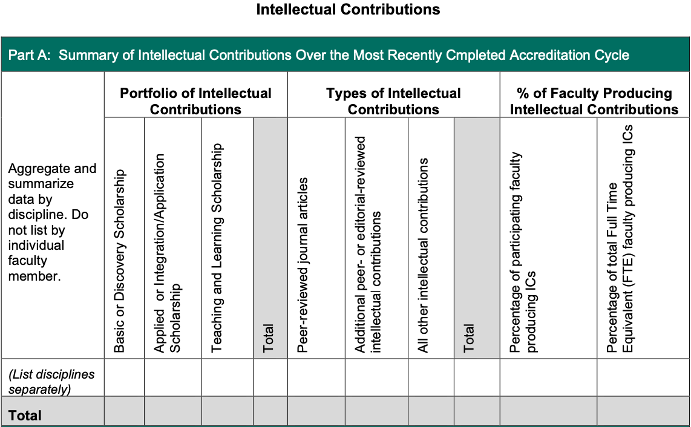

* **AACSB: TABLE 8-2**

    Five-Year Summary of Peer-Reviewed Journals and Number of Publications in Each

    說明：5年內各期刊發表篇數一覽表，根據 TABLE 8-1 提供期刊名稱與數量（共同著作不重複計算），以及分領域（或系所）在 TABLE 8-1 納入的「有審閱制度」期刊名稱與篇數，院內教師共同著作論文得分別計算。

* **AACSB: TABLE 3-1**

    彙整各系所的個別教師之下表資料。

    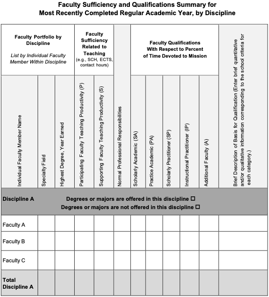

    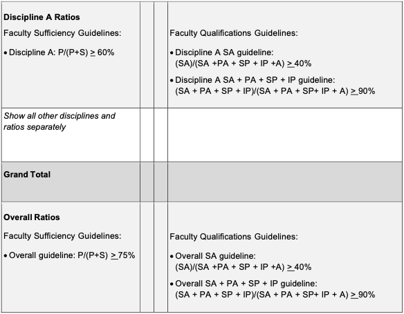

* **AACSB: TABLE 3-2**

    總表一張，分學士班、碩士班、MBA、IMBA、MBA Program (MBA+IMBA)、EMBA、DBA、博士班也要各一張。

    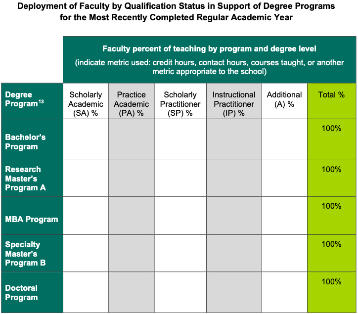

* **AACSB: TABLE 15-1**

    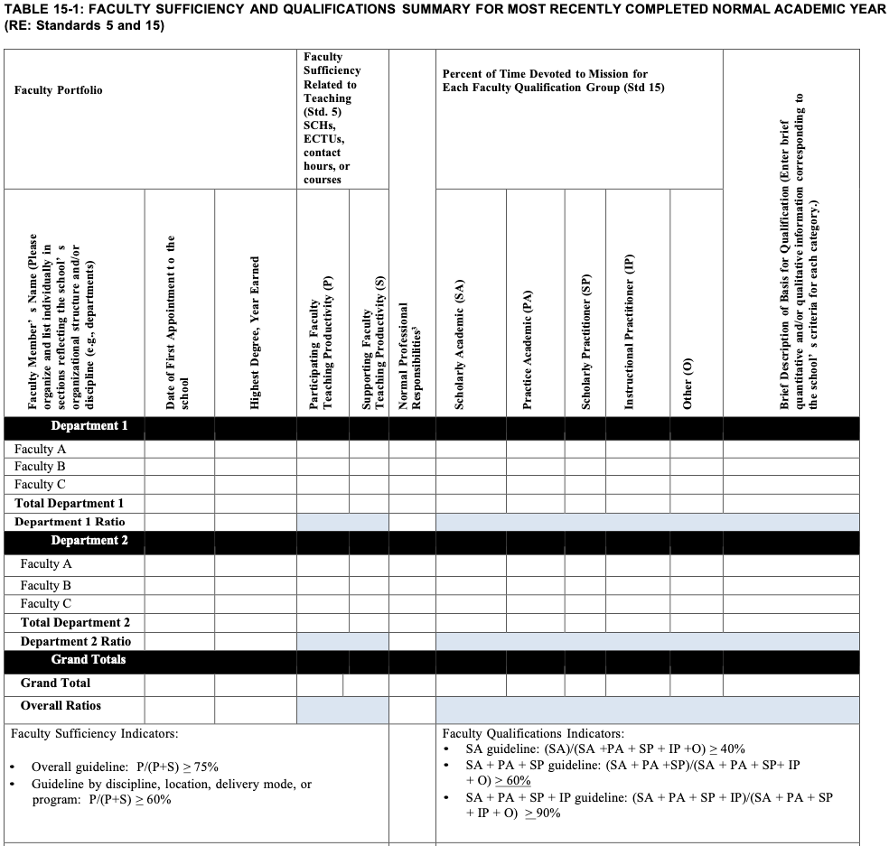

* **EQUIS: TABLE 2 Research**

    每個欄位底下要再細分個別年份與五年總和。

    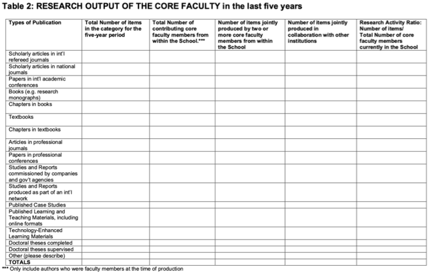

* **EQUIS: TABLE 3 Research**

    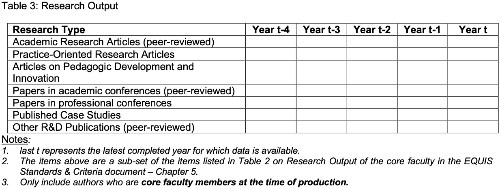

* **EQUIS: TABLE 4**

    僅需計算第一個欄位。

    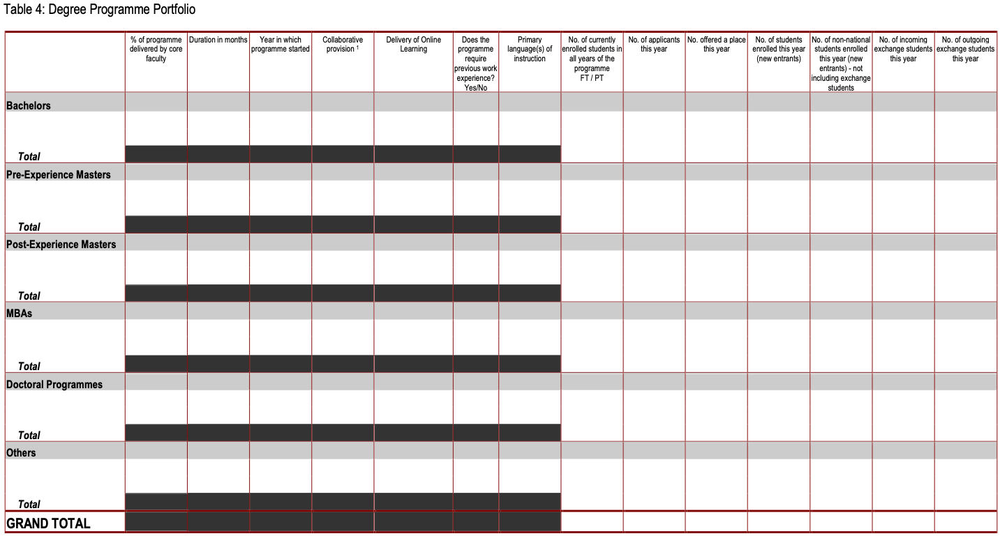

* **EQUIS: TABLE 6 Academic Research**

    由A1-A3清單中的「Journal名稱」欄位，將院內各系自行輸入的期刊類別移除重複，計算這個期刊在院內共發表幾篇，依照期刊數量由大到小排序。

    注意：有些期刊名會有錯誤，需至其他表格手動修正合併。

    限制：E1、E2、E7、E8總篇數應與這張表的總和相同。

    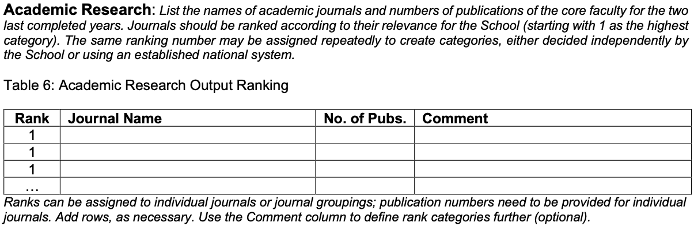

* **EQUIS: TABLE 7 Practice-Oriented Research**

    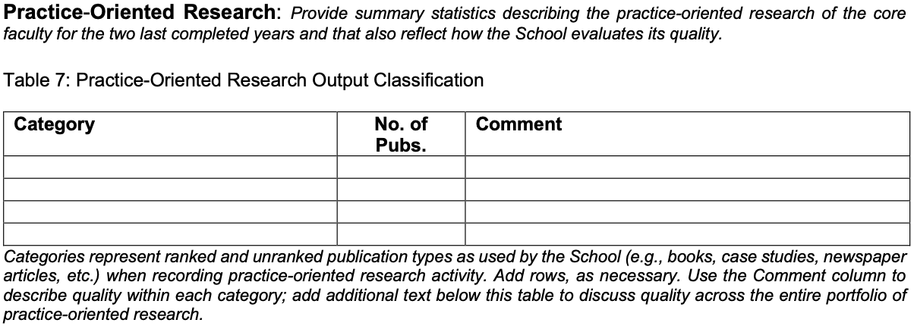

* **其他：社會影響力**

    分專任與兼任，彙整不同年份在欄位 PA1-1 至 PA1-8、SP1-1 至 SP1-3、IP1-1 至 IP1-5 的人數。

* **表格參考來源：**

    [AACSB](https://www.aacsb.edu/-/media/documents/accreditation/business/standards-and-tables/2020-aacsb-business-accreditation-standards-july-2021.pdf?rev=8f56bd6ca50244c28b98ef6e94fc7790&hash=DE23836C3FF3B50CB82FA501ED29B581), [EQUIS-1](https://www.efmdglobal.org/wp-content/uploads/2023_EQUIS_Standards_and_Criteria.pdf), [EQUIS-2](https://www.efmdglobal.org/wp-content/uploads/2023_EQUIS_Process_Manual_Annexes.pdf)

### ➤此階段資料處理需求：

1. 減輕各系助教重複複製貼上的動作
2. 有些資料在其他地方已有，不需要一直手動輸入
3. 自動化產生出上述眾多TABLE（各系報表）
4. 教師履歷研究興趣等內容，是否要限制輸入格式

## 6.認證辦公室彙整各系教師資料

各系報表產出後，會由認證辦公室回收所有報表並彙整成全院總報表，並提交給學院確認。

### ➤此階段資料處理需求：

1. 同樣解決重複複製貼上的動作

## 7.學院進行最後確認

學院確認完畢後，即可彙整進國際認證報告書，準備提交給認證單位審核。

# 教師履歷管理系統設計

## 資料需求分析

1. 電算中心提供的各項資料能匯入系統進行更新。
1. 利用系統功能初步產出相對應的資料欄位（derived attributes）。
1. 每位教師進入系統可查看並修正個人研究計畫與獎項等資料，同時填寫個人履歷資訊，包含研究興趣、近一年擔任的校外職務等。
1. 各系助教進入系統可查看所有系上教師相關資料，並修正教學科目數的計算。
1. 取得所有教師履歷資訊後，系統能自動計算所需資料欄位，並產生各式報表，如各系學術貢獻、不同學制下的課程規劃種類等。其中，各系助教可以查看所屬系所的報表，認證辦公室則可以查看所有系所的報表。

### Entity Types

斜體者為 primary key 或 partial key。

* Department(系所): *department_id*(系所代碼)、department_name[department_Cname(系所中文名稱), department_Ename(系所英文名稱)]

* Teacher(教師): *teacher_id*(教師編號)、name[Cname(中文姓名), Ename(英文姓名)]、job_title(職稱)、year(到職年)

    註：teacher_type(專兼別)移動到Class(開課時數)。

* (weak)Resume(教師履歷): *resume_year*(填寫年份)、highest_education[degree(學位), department(系所), school(學校), graduation_year(取得學位年份)]、experience(經歷)、teaching_interests(教學興趣)、research_interests(研究興趣)、discipline(學群)、recent(近一年...)[AMD(擔任行政職務), ED(教授高管班), SER(其他服務如借調、期刊編輯、主編、審稿), PA1-1&IP1-1(借調至產學界或政府機關), PA1-2(參與產業界的活動或與產業界主管有聯繫互動), PA1-3(參與產業經營或擔任專業職務), PA1-4(於學會/協會組織擔任高階職務), PA1-5(參與學會/協會團體組織之活動), PA1-6(長期提供企業諮詢（一年以上）), PA1-7&IP1-3(擔任董事會（理事會）/監察人（監事）相關職務), PA1-8&SP1-3(具商管教育經歷並持續累積中), SP1-1(參與學術/業界相關之活動/社群/學會/協會), SP1-2(於業界擔任重要職務), IP1a(具有產業界全職或兼職之工作), IP1-2(企業主、合夥人、或專業經理人), IP1-4(業界活躍人士), IP1-5(會計師、律師或擁有其他專業證照)]

    derived attributes: RES、合併教學責任、Basic or Discovery Scholarship、Applied or Integration/Application Scholarship、Teaching and Learning Scholarship、總著作篇數小計、總著作篇數*貢獻度、PRJ、Additional Peer- or Editorial-Review Intellectual Contributions、All Other Intellectual Contributions、驗算欄、教師分類SA、教師分類PA、教師分類SP、教師分類IP、教師分類Other、SA0、SA1、SA1-1、SA1-2、SA1-3、PA1、PA1a、SP1、全學年專任權重for P/(P+S)、Brief Description、Faculty Qualification

* (weak)PartTime(校外兼職): *pt_company*(兼職機關)、*pt_department*(兼職單位)、*pt_position*(兼職職稱)、*pt_start*(兼職起日)、*pt_end*(兼職迄日)

<!---

* Work(論著資料): *work_id*(論著編號)、title[work_title1(論著名稱一), work_title2(論著名稱二)]、work_ym(論著年月)、work_type(論著類別)、journal(期刊名)、journal_db(期刊資料庫所屬)、review(審查制度)、book_type(專書性質)、co_work(著作人數)、co_worker[co_worker1(合著者1), co_worker2(合著者2), co_worker3(合著者3), ..., co_worker12(合著者12)]
    
    derived attributes: SSCI/SCI/TSSCI or equivalent、與本院教授共同創作、與本院學生或本校外院師生或校外人士共同創作、屬性、EQUIS的分類、AACSB的分類

* (weak)Project(研究計畫): *project_id*(研究計畫編號)、project_title(計畫名稱)、project_position(計畫職稱)、approved_year(核定年度)、start_year(起始年度)、unit(委託單位)、project_type(計畫類別)、project_duration(起迄日期)

    derived attributes: 屬性、EQUIS的分類、AACSB的分類

* (weak)Award(獎項): *award_year*(得獎年度)、*award_name*(獎項名稱)、award_by(頒獎單位)、award_note(備註)

    derived attributes: 屬性、EQUIS的分類、AACSB的分類

-->

* (weak)List(學術、實務與教學貢獻清單): *item_name*(篇名/獎項/政策法案名稱/論文題目/計畫名稱)、*item_year*(年度)、journal(期刊名)、journal_type(期刊屬SSCI/SCI/TSSCI or equivalent)、co_worker_in(與本院教授共同創作姓名)、co_worker_out(與本院學生或本校外院師生或校外人士共同創作姓名)、scholarship_type(屬性)、*equis*(EQUIS分類)

    derived attributes: aacsb(AACSB分類)

* (weak)FacultyType(專兼別): *year_semester*[year(學年度), semester(學期)]、teacher_type(專兼別)

* (weak)Class(開課時數): *degree*(學制)、num_class(科目數)

    (?) derived attributes: 調查年度最後一年的第一學期為專任或兼任、調查年度最後一年的第二學期為專任或兼任、調查年度最後一年的第一學期授課科目數、調查年度最後一年的第二學期授課科目數、貢獻度、UT、MT、DT

### Relationship Types

* 一個Department(系所)必有一位以上Teacher(教師)
* 一位Teacher(教師)必屬於單一個Department(系所)
* 一位Teacher(教師)可填寫多份(指不同年份)Resume(教師履歷)
* 一份Resume(教師履歷)必由一位Teacher(教師)填寫
* 一位Teacher(教師)可以從事多份PartTime(校外兼職)
* 一份PartTime(校外兼職)必由一位Teacher(教師)從事
* 一位Teacher(教師)可以擁有多個List(學術、實務與教學貢獻清單)
* 一個List(學術、實務與教學貢獻清單)必由一位Teacher(教師)擁有
* 一位Teacher(教師)可以在多個學期擁有FacultyType(專兼別)身份
* 一個FacultyType(專兼別)身份必為一位Teacher(教師)擁有
* 一個FacultyType(專兼別)身份必至少有一筆Class(開課時數)
* 一筆Class(開課時數)必為一個FacultyType(專兼別)所開

<!---
* 一位Teacher(教師)可以擁有多個Work(論著資料)
* 一個Work(論著資料)必由至少一位Teacher(教師)擁有
* 一位Teacher(教師)可以參與多個Project(研究計畫)
* 一個Project(研究計畫)必由至少一位Teacher(教師)參與
* 一位Teacher(教師)可以主持多個Project(研究計畫)
* 一個Project(研究計畫)必由一位Teacher(教師)主持 -> attributes: director_id(主持人編號)
* 一位Teacher(教師)可以獲得多個Award(獎項)
* 一個Award(獎項)必由至少一位Teacher(教師)獲得
-->

## 系統功能分析

為了簡化過往的教師履歷彙整流程，我們決定設計可供認證辦公室、各系助教與教師填寫資料的系統，使用者登入系統填寫完的資料直接彙整進資料庫，不必一一經過認證辦公室與各系助教的手動彙整。其中認證辦公室的操作權限最完整，為整個系統的管理者，各系助教則可以調整與查看系上教師的資料，而個別教師只能編修個人的相關內容。

1. 系統要可自訂報表產出的年份區間：AACSB要求六年，EQUIS則是五年。
1. 系統要有可以暫存與確認送出的功能，避免助教或教師需要多一點時間完成所有內容的填寫。
1. 同一位教師有可能因專兼別不同而有兩個教師編號，有此情況大多是專任教師退休後轉兼任，只有少數情況為博士後研究員從兼任轉為專任。
1. 原始資料有西元年與民國年的差異，需要再留意。

### CRUD

1. 認證辦公室

    掌管所有權限，製作操作手冊，並限制系統蒐集資料的年度區間與系統開放時間，可透過系統發送郵件(?)通知各系助教與教師開始填寫資料。另外，因需等所有資料蒐集完畢才能產生報表，故該年度蒐集完畢前，僅能檢視歷年資料。

    Create：向電算中心取得相關資料，用以新增系所、教師、研究計畫、論著資料、獎項、開課時數、校外兼職等，包含新增新一年度的資料或新增資料欄位。

    Read：所有原始資料與所有額外計算的資料，也能查看所有產出的報表。

    Update：資料欄位計算變更。

    Delete：教師未繼續任職則刪除該教師相關資料。

2. 各系助教

    因開課資料計算上較為複雜，需要請各系助教統一進行系上教師的教學科目數確認與修正，未於期限內完成修改與確認時，系統會發送郵件(?)通知。

    Create：無。

    Read：系上教師所的填寫內容，以及屬於該系的報表。

    Update：若教學科目數的計算結果有誤，可以進行修改。

    Delete：無。

3. 個別教師

    未於期限內完成填寫與確認，系統會發送郵件(?)通知，相關欄位也會顯示其填寫限制，避免資料品質不一致。

    Create：新增系統未登錄的研究計畫、論著資料、獎項或校外兼職資料，以及填寫教師履歷。

    Read：僅能讀取個人的資料。

    Update：確認研究計畫、論著資料、獎項與校外兼職資料是否有誤，可以修正其內容。

    Delete：可刪除研究計畫、論著資料、獎項或校外兼職資料。

### 認證辦公室使用介面

使用者登入後，可以設定以下內容(未完待續)：

1. n值：資料蒐集連續n個年度。
1. t值：使系統蒐集之資料區間為[t-5]-[t]年 (eg. 2019-2024年)。
1. s值：資料蒐集之s學年度 (eg. 112學年度)。
1. 截止時間：各系助教與教師需要完成填答的日期。

### 教師使用介面

使用者登入後，有兩個頁籤(?)可供教師修正與填寫資料。

1. 基本資料與近一年社會影響力

    > (說明文字)
    >
    > [中文姓名][職稱] 您好：
    > 
    > 請確認以下基本資料是否正確，如需修正，請直接點選欄位進行修改；「近一年」相關問項，請以[t-1].08.01-[t].07.31 (eg. 2023.08.01-2024.07.31) 之經歷填入。謝謝！

    因其資料性質與後述之「學術、實務與教學貢獻清單」不同，每位教師一個欄位只有一個值要填寫，故此處可以直式呈現填寫畫面，類似目前在md檔上看到的表格樣態（列：欄位；欄：填答結果）。

| 欄位名稱                         | 欄位說明                                                                           | 欄位選項                                                                                                                                                                                                                                                                                                                                                                                                                                                                                                                                                                                                                                                                                                                                                                                                                           |
|------------------------------|--------------------------------------------------------------------------------|--------------------------------------------------------------------------------------------------------------------------------------------------------------------------------------------------------------------------------------------------------------------------------------------------------------------------------------------------------------------------------------------------------------------------------------------------------------------------------------------------------------------------------------------------------------------------------------------------------------------------------------------------------------------------------------------------------------------------------------------------------------------------------------------------------------------------------|
| 教師編號                         |                                                                                | 自動帶入，不可更改                                                                                                                                                                                                                                                                                                                                                                                                                                                                                                                                                                                                                                                                                                                                                                                                                      |
| 中文姓名                         |                                                                                | 自動帶入                                                                                                                                                                                                                                                                                                                                                                                                                                                                                                                                                                                                                                                                                                                                                                                                                           |
| 英文姓名                         |                                                                                | 自動帶入                                                                                                                                                                                                                                                                                                                                                                                                                                                                                                                                                                                                                                                                                                                                                                                                                           |
| 職稱                           | Professor 教授, Associate Professor 副教授, Assistant Professor 助理教授, Instructor 講師 | 自動帶入，選單：Professor, Associate Professor, Assistant Professor, Instructor                                                                                                                                                                                                                                                                                                                                                                                                                                                                                                                                                                                                                                                                                                                                                        |
| 到職年                          | 西元年                                                                            | 自動帶入                                                                                                                                                                                                                                                                                                                                                                                                                                                                                                                                                                                                                                                                                                                                                                                                                           |
| 系所                           |                                                                                | 自動帶入                                                                                                                                                                                                                                                                                                                                                                                                                                                                                                                                                                                                                                                                                                                                                                                                                           |
| 學群                           | 選擇自身專業所屬學群                                                                     | 選單：Accounting, Actuarial Science, Behavioral Science / Organizational Behavior, Business Communication, Business Education, Business Ethics - incl Corporate Social Responsibility, Business Law / Legal Enviroment, Computer or, Management Information Systems, Consulting, Data Analytics, E-Business - inxl Economics, Economics / Mnagerial Economics, Entrepreneurship / Small Business Admin, Finance - incl Banking, General Business, HR Mgt - incl, Personnel & Ind / Labor Relations, Insurance, Intellectual Property, International Business, Management, Manufacturing and Technology Management, Marketing, Operations Research, Production / Operations Management, Public Administration, Quantitative Methods, Real Estate, Statistics, Strategic Management, Supply Chian / Transport / Logistics, Taxation |
| 最高學位                         | PhD 博士, TAX 稅法碩士, A+L 會計及法律雙碩士, ABD 博士候選人, Master 碩士, Bachelor 學士, Other 其他    | 選單：PhD, TAX, A+L, ABD, Master, Bachelor, Other                                                                                                                                                                                                                                                                                                                                                                                                                                                                                                                                                                                                                                                                                                                                                                                 |
| 最高學位系所                       | 以英文填寫                                                                          | 字串                                                                                                                                                                                                                                                                                                                                                                                                                                                                                                                                                                                                                                                                                                                                                                                                                             |
| 最高學位校名                       | 以英文填寫                                                                          | 字串                                                                                                                                                                                                                                                                                                                                                                                                                                                                                                                                                                                                                                                                                                                                                                                                                             |
| 取得最高學位年份                     | 西元年                                                                            | 數值                                                                                                                                                                                                                                                                                                                                                                                                                                                                                                                                                                                                                                                                                                                                                                                                                             |
| 經歷                           | 以英文填寫                                                                          | 長字串                                                                                                                                                                                                                                                                                                                                                                                                                                                                                                                                                                                                                                                                                                                                                                                                                            |
| 教學興趣                         | 以英文填寫                                                                          | 長字串                                                                                                                                                                                                                                                                                                                                                                                                                                                                                                                                                                                                                                                                                                                                                                                                                            |
| 研究興趣                         | 以英文填寫                                                                          | 長字串                                                                                                                                                                                                                                                                                                                                                                                                                                                                                                                                                                                                                                                                                                                                                                                                                            |
| 近一年擔任行政職務                    | 有請填1，無請填0                                                                      | 選單：0, 1                                                                                                                                                                                                                                                                                                                                                                                                                                                                                                                                                                                                                                                                                                                                                                                                                        |
| 近一年教授高管班(指無學位的課程)，如：企家班。     | 有請填1，無請填0                                                                      | 選單：0, 1                                                                                                                                                                                                                                                                                                                                                                                                                                                                                                                                                                                                                                                                                                                                                                                                                        |
| 近一年教學責任-其他服務，如：借調、期刊編輯、主編、審稿 | 有請填1，無請填0                                                                      | 選單：0, 1                                                                                                                                                                                                                                                                                                                                                                                                                                                                                                                                                                                                                                                                                                                                                                                                                        |
| 近一年借調至產學界或政府機關               | 有請填1，無請填0                                                                      | 選單：0, 1                                                                                                                                                                                                                                                                                                                                                                                                                                                                                                                                                                                                                                                                                                                                                                                                                        |
| 近一年參與產業界的活動或與產業界主管有聯繫互動      | 有請填1，無請填0                                                                      | 選單：0, 1                                                                                                                                                                                                                                                                                                                                                                                                                                                                                                                                                                                                                                                                                                                                                                                                                        |
| 近一年參與產業經營或擔任專業職務             | 有請填1，無請填0                                                                      | 選單：0, 1                                                                                                                                                                                                                                                                                                                                                                                                                                                                                                                                                                                                                                                                                                                                                                                                                        |
| 近一年於學會/協會組織擔任高階職務            | 有請填1，無請填0                                                                      | 選單：0, 1                                                                                                                                                                                                                                                                                                                                                                                                                                                                                                                                                                                                                                                                                                                                                                                                                        |
| 近一年參與學會/協會團體組織之活動            | 有請填1，無請填0                                                                      | 選單：0, 1                                                                                                                                                                                                                                                                                                                                                                                                                                                                                                                                                                                                                                                                                                                                                                                                                        |
| 近一年長期提供企業諮詢（一年以上）            | 有請填1，無請填0                                                                      | 選單：0, 1                                                                                                                                                                                                                                                                                                                                                                                                                                                                                                                                                                                                                                                                                                                                                                                                                        |
| 近一年擔任董事會（理事會）/監察人（監事）相關職務    | 有請填1，無請填0                                                                      | 選單：0, 1                                                                                                                                                                                                                                                                                                                                                                                                                                                                                                                                                                                                                                                                                                                                                                                                                        |
| 近一年具商管教育經歷並持續累積中             | 有請填1，無請填0                                                                      | 選單：0, 1                                                                                                                                                                                                                                                                                                                                                                                                                                                                                                                                                                                                                                                                                                                                                                                                                        |
| 近一年參與學術/業界相關之活動/社群/學會/協會     | 有請填1，無請填0                                                                      | 選單：0, 1                                                                                                                                                                                                                                                                                                                                                                                                                                                                                                                                                                                                                                                                                                                                                                                                                        |
| 近一年於業界擔任重要職務                 | 有請填1，無請填0                                                                      | 選單：0, 1                                                                                                                                                                                                                                                                                                                                                                                                                                                                                                                                                                                                                                                                                                                                                                                                                        |
| 近一年具有產業界全職或兼職之工作             | 有請填1，無請填0                                                                      | 選單：0, 1                                                                                                                                                                                                                                                                                                                                                                                                                                                                                                                                                                                                                                                                                                                                                                                                                        |
| 近一年企業主、合夥人、或專業經理人            | 有請填1，無請填0                                                                      | 選單：0, 1                                                                                                                                                                                                                                                                                                                                                                                                                                                                                                                                                                                                                                                                                                                                                                                                                        |
| 近一年業界活躍人士                    | 有請填1，無請填0                                                                      | 選單：0, 1                                                                                                                                                                                                                                                                                                                                                                                                                                                                                                                                                                                                                                                                                                                                                                                                                        |
| 會計師、律師或擁有其他專業證照              | 有請填1，無請填0                                                                      | 選單：0, 1                                                                                                                                                                                                                                                                                                                                                                                                                                                                                                                                                                                                                                                                                                                                                                                                                        |
| 填寫年份                         | 西元年                                                                            | 自動帶入，直接顯示認證辦公室設定年份區間的最後一年，不可更改                                                                                                                                                                                                                                                                                                                                                                                                                                                                                                                                                                                                                                                                                                                                                                                                 |

(列示校外兼職列表提供老師參考?)

2. 學術、實務與教學貢獻清單

    > (說明文字)
    > 
    > [中文姓名][職稱] 您好！
    > 
    > 以下清單列示您[t-5]-[t]年 (eg. 2019-2024年) 之：
    > 
    > a. 論著—期刊、會議論文、專書、個案、教學教材
    > 
    > b. 重要研究獎項
    > 
    > c. 參與專業/公共政策制定法案
    > 
    > d. 指導畢業的博士論文
    >
    > e. 政府或產業計畫、國科會計畫
    > 
    > 請確認以下資料是否正確，如需修正，請直接點選欄位進行修改；如需新增內容，請點選「+」新增資料；刪除資料則勾選「刪除」即可。謝謝！

    下方表列所有屬於該教師的學術、實務與教學貢獻資料，呈現欄位包括（列：每筆資料；欄：欄位）：

| 欄位名稱                         | 欄位說明                   | 欄位選項                                                                                                                 |
|------------------------------|------------------------|----------------------------------------------------------------------------------------------------------------------|
| 類別                           |                        | 選單：期刊論文, 會議論文, 研究報告, 專書, 專書篇章, 個案, 獎項, 法案, 指導畢業博士論文, 研究計畫                                                            |
| 年度                           | 西元年，研究計畫請輸入起始年度        | 選單：應介於認證辦公室設定的年度區間，如2019-2024                                                                                        |
| 名稱                           | 篇名/獎項/政策法案名稱/論文題目/計畫名稱 | 字串                                                                                                                   |
| Journal名稱                    | 類別為「期刊論文」才需填寫          | 字串                                                                                                                   |
| SSCI/SCI/TSSCI or equivalent | 類別為「期刊論文」才需填寫，其他資料皆為X  | 選單：O, X                                                                                                               |
| 與本院教授共同創作                    | 註明合著作者姓名，用分號（；）分隔      | 字串                                                                                                                   |
| 與本院學生或本校外院師生或校外人士共同創作        | 註明合著作者姓名，用分號（；）分隔      | 字串                                                                                                                   |
| 屬性                           | 依據學術、實務、教學屬性選擇         | 選單：Basic_or_Discovery_Scholarship, Applied_or_Integration_Application_Scholarship, Teaching_and_Learning_Scholarship |
| EQUIS分類                      | 系統初步分類，可依需求修改          | 選單：E1-E15                                                                                                            |
| 刪除該筆資料                       | 勾選即刪除整列資料              | 勾選方格                                                                                                                 |

* Note:「論著資料」資料表才有「論著類別」欄位，裡面有分類期刊論文、會議論文、研究報告、專書、專書篇章、個案、學術交流、其他。因原始資料無法案制定與指導畢業博士論文相關資料，故可以新增於「論著資料」中(?)，抑或 entity type合併？
* Note: 不同「屬性」會有不同的「EQUIS分類」可選擇，可參見[說明](#屬性與equis分類)。

### 各系助教使用介面

使用者登入後，有四個頁籤(?)可供教師修正與填寫資料。

1. 基本資料與近一年社會影響力

    > (說明文字)
    >
    > [系所名稱][中文姓名]助教 您好：
    > 
    > 下表為貴系教師之基本資料與近一年社會影響力填答情形，請協助提醒教師於[截止時間]前填寫完成，謝謝！

    與教師的「基本資料與近一年社會影響力」欄位相同，但會顯示該系所有教師，故呈現方式可更改（列：每位教師；欄：欄位）。

2. 學術、實務與教學貢獻清單

    > (說明文字)
    > 
    > [系所名稱][中文姓名]助教 您好：
    > 
    > 以下清單列示貴系教師[t-5]-[t]年 (eg. 2019-2024年) 之：
    > 
    > a. 論著—期刊、會議論文、專書、個案、教學教材
    > 
    > b. 重要研究獎項
    > 
    > c. 參與專業/公共政策制定法案
    > 
    > d. 指導畢業的博士論文
    >
    > e. 政府或產業計畫、國科會計畫
    > 
    > 請協助提醒教師於[截止時間]前填寫完成，謝謝！

    與教師的「學術、實務與教學貢獻清單」欄位相同，並增加教師姓名欄位，並顯示該系所有教師的資料。

3. 教學科目數

    > (說明文字)
    > 
    > 教學科目數計算說明如下：
    > 
    > * 學碩合開課，學0.5、碩0.5；碩博合開課，碩0.5、博0.5。
    > * 多位教師合授，需乘上實授學分數權重。EX：1門課學碩合開、A老師(1學分)與B老師(2學分)兩位老師合授3學分，A老師的學士班教學科目數 = 1 * 0.5 * (1/3) = 0.17
    > * 本系老師支援本院外系(除MBA、IMBA、EMBA、DBA)的課要算，但MBA、IMBA、EMBA、DBA由專責辦公室/助教自己算，支援外院的課都不算。
    > * 只計算有真正實際授課且有學分的課程，如：服務課、外語檢定、教學實習與實務等課程不算。
    >
    > 
    > 請助教完成系上教師[s]學年度之教學科目數計算，謝謝。

    先呈現[s]學年度，後可選擇第一學期或第二學期，並列示以下內容供助教修改：

| 欄位名稱  | 欄位說明          | 欄位選項      |
|-------|---------------|-----------|
| 教師編號  |               |           |
| 教師姓名  |               |           |
| 專兼別   |               | 選單：專任, 兼任 |
| 學士班   | 由系所助教填寫科目數    |           |
| 一般碩士班 | 由系所助教填寫科目數    |           |
| 博士班   | 由系所助教填寫科目數    |           |
| MBA   | 由專責辦公室助教填寫科目數 |           |
| IMBA  | 由專責辦公室助教填寫科目數 |           |
| EMBA  | 由專責辦公室助教填寫科目數 |           |
| DBA   | 由專責辦公室助教填寫科目數 |

4. 全系報表

    根據資料蒐集結果，產生[這些](#3-產生各系報表)報表。

# 開發團隊與心得

**組名｜複製貼上熊貓團**

**組長｜112354001 林兆鵬 統碩一**

前端開發 (16.67%)

這學期接觸了蠻多資料庫的知識，也真正了解到資料儲存的方法，受益良多，其中最特別的是期末專案的部分，因為本身對於javaScript不是特別了解，經過這次的期末專案算是更進一步了解到javaScript是怎麼在前端與後端運作的，期末的專案也是從無到有大家各自分工完成，這學期真的算是收穫滿滿。

**組員｜109703039 金娜伶 資科四**

後端開發 (16.67%)

平時沒有經常使用 Python，但藉由這次的專案多少有些熟悉了。雖然需要處理的大量數據讓我覺得不容易，但在組員們的幫助下整理得很好，因此工作變得順利了許多。以前我會在程式碼中直接寫query，現在使用 SQLAlchemy 可以通過函數操作數據庫，這樣方便多了。過去主要是做一些小型的個人專案，而這次是以實際服務為目標開始的專案，對我來說是一次新的體驗，也非常有意義。

**組員｜111354007 韓昕頻 統碩二**

後端開發 (16.67%)

這是我第一次接觸到完整開發資料庫系統的過程，通過這次報告，我對前端和後端技術有了初步的了解，同時我也意識到自己還有很多不足之處需要學習，感謝我的組員們給予了我很多幫助和包容，讓我在這堂課中受益匪淺。

**組員｜111354014 劉貞莉 統碩二**

後端開發 (16.67%)

自己是認證辦公室工讀生的身份，在團隊中主要負責了解辦公室需求並將初步構想彙整後轉達給小組，不過這是第一次參與包括前後端架構的專題，雖能力有限，但藉著這次機會使我對應用專題的設計上有更進一步的認識，謝謝組員們與老師，這一學期收穫滿滿～也相信有這個系統後，後續辦公室接手開發會更加得心應手！

**組員｜112354030 陳宏丞 統碩一**

前端開發 (16.67%)

在前期編寫網頁內容時，我們只能透過各別單獨的檔案讀取教師資料，不僅效率較低且容易出錯。然而在接上後段和資料庫後，不但有了一個結構化的資料存儲方式還可以根據需求透過query快速得到我們需要的資訊，大幅提升了效率。這讓我瞭解到一個資料庫管理系統能為使用者帶來多少幫助。

**組員｜112753125 楊佳勳 資碩一**

後端開發 (16.67%)

透過這次的學期專案首次接觸到 python 的 Flask 框架，更了解了對於後端和資料庫的串接，也體會到一個專案從主題發想、設計架構到分工實作是一條漫長嚴謹的路，雖然礙於期末時間相對緊迫沒有辦法把每一步都處理得很完美，但也讓我對軟體開發的流程有更具體的概念。
